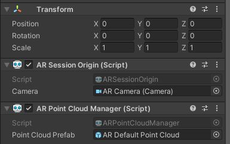
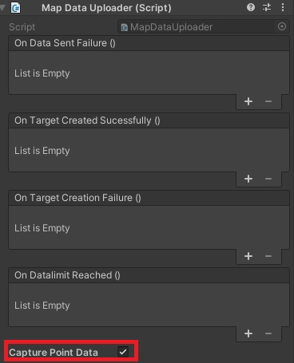

# Mapping instructions

## Mapping/Update
- Make sure the compass is stable before moving around (the compass is represented by the different axis of different colors, it's position will determine the origin of your map). You can use the compass to make sure the SLAM is stable and your mapping sends correct datas
- Walk at an **easy pace** so there are not brutal changes between two data captures otherwise ARFoundation will lose the phone tracking and your data may have a problem.
- If you turn, **turn slowly** otherwise, the relocation at turn positions will have issues.
- The datas that will be used for data generation are the data SENT, if a data is captured but NOT SENT it will not be taken into account during the data generation.
- Depending on your data the map generation can take up to 10 minutes.

## Sending point cloud datas
If you want to send point cloud datas druing, make sure you setup the AR Point cloud manager in your AR Session Origin.

Once you did this go to the StardustComponents prefab and check the "Capture Point Data" option of the **Map Data Uploader** component

That's it! Now whenever you capture datas via the map data uploader you will also capture the point cloud and send them into the editor!

## Data plan
If you are a free user your plan is capped to a maximum of 400 data packages but we had very good recognition rates with 170 pictures (original mapping) in our office.
